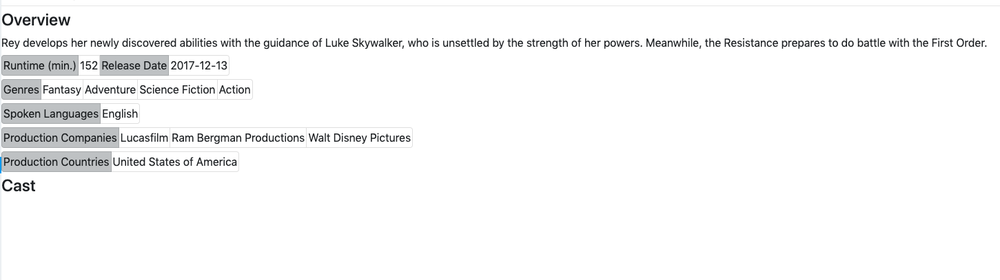
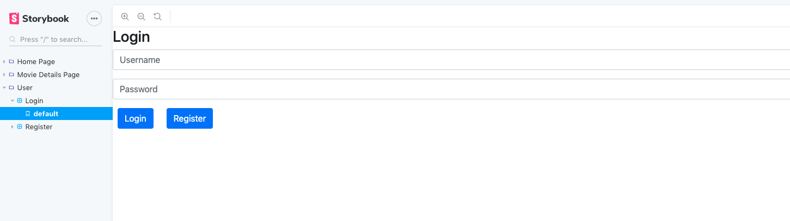
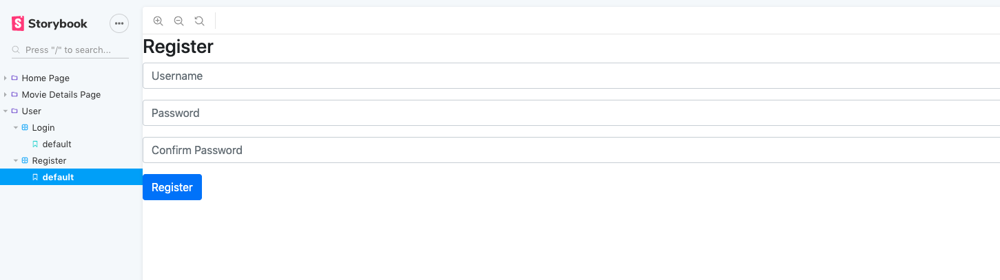
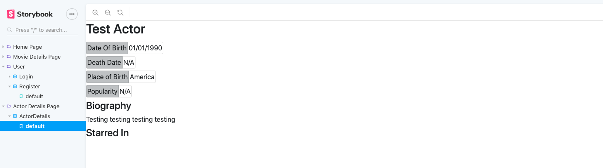
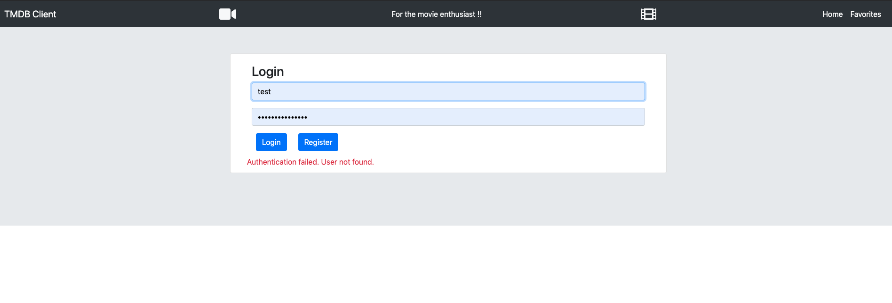
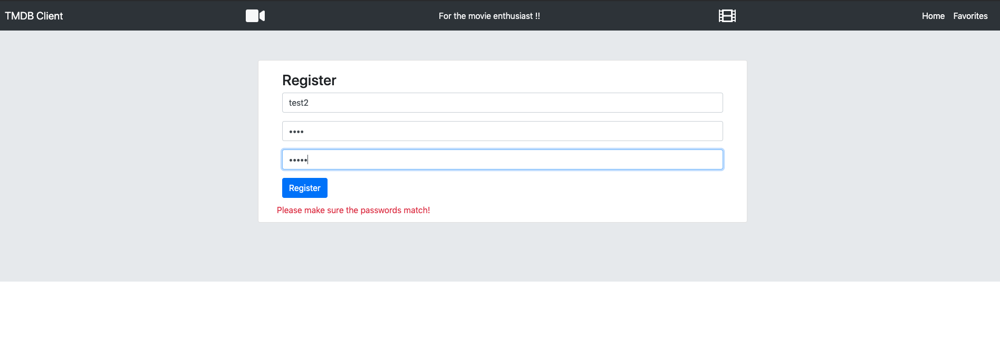
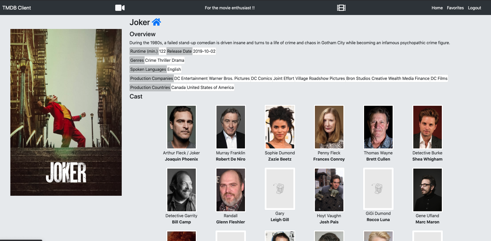
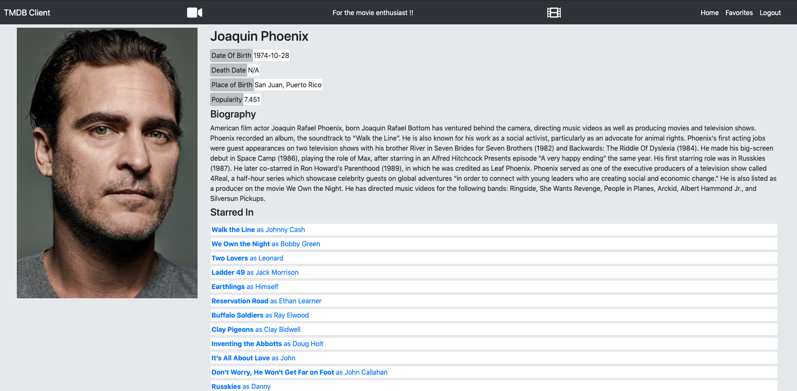

# Assignment 1 - ReactJS app.

Name: Oleksandr Kononov

## Overview.
The additional objective for the Movie App would be the following:
- Extend movies page with list of actors.
- Create actors page giving actors info + movies actor starred in.
- Create personalised views by having users login/register/logout (i.e. favourites).
- Create login/register views.
- Protect pages until a valid user logs in.

## Setup requirements.
- NPM (comes with NodeJS, can be downloaded [here](ttps://nodejs.org/en/download/))
- Terminal
- Git (for cloning this repo)
- API sibling project (Required!) - [here](https://github.com/ASimpleMeow/ewd-api-labs-2020)

In the root of this repo, run `npm install && npm start`

## Data Model Design.
Additional API endpoints used:

| Additional API | TMDB It Uses | Description
| -- | -- | --
| /api/movies/{id}/credits | /movie/{id}/credits | Gets credits (actors) for the movie 
| /api/actor/{id} | /person/{id} | Gets actor info 
| /api/actor/{id}/movies | /person/{id}/movie_credits | Gets movies the actor starred in
| /api/users/ | N/A | Registers/Login in a user
| /api/users/{user}/favourites | N/A | Gets/Adds favourites movies to user
| /api/movies/{id}/reviews | N/A | (POST) adds a review to a movie

## App Design.

### Component catalogue.
#### Movie cast (gets it from TMDB using custom hook)

#### Login Form

#### Register Form

#### Actor Details (gets movies from TMDB using custom hook)

### Design patterns.
The uses of template Pages is used a lot (i.e. Actor Details) has the same "style" to it as the Movies page by using the *PageTemplate* from the *templateActorPage* which renders it's "children" inside (i.e. Container), the *actorPage* will will also use the *ActorDetails* to render the actor details *actor* (i.e. Rendering props).

The Provider pattern is also used a lot with the contexts:
- genreContext (keeping track of genres for filtering)
- moviesContext (keeping track of movies & users favourite movies)
- userContext (keeping track of logged in user + their api token)

## UI Design.

### Login Page (to access private routes)

>Will propmt the user to login straight away, will validate input and inform the user if something is not correct.

### Register Page (to create a new user)

>Has validation in frontend (password required, etc) and backend (user already exists, etc)

### Movie Details Cast

>Click on an actor will open their actor details page

### Actor Details Page

>Clicking on the movies for that actor will open the movie details page for that movie

### Page header - logout

>Page header has a logout button to log the user out

## Routing.
### Non Private Routes
* `/login` - Login page, once logged in will redirect to previous page
* `/register` - Register page, once registered will automatically login with newly created user and redirect to previous page

### Private Routes
* `/movies` - Main page, private route, unknown routes are redirected here
* `/movies/:id` - Movie details page
* `/movies/favourites` - User specific favourites page, private route
* `/reviews/form` - AddMovieReviewPage, private route
* `/reviews/:id` - Movie review page, private route
* `/actor/:id` - Actor details page for a specific actor (:id)

## Independent learning.

- Research on [contexts](https://reactjs.org/docs/context.html) and their usage/implementation (for userContext)